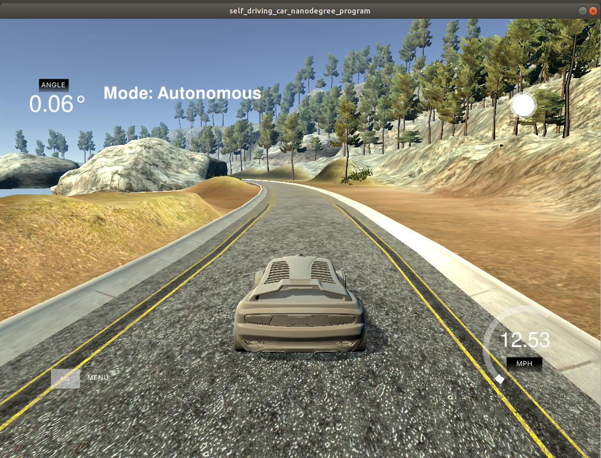
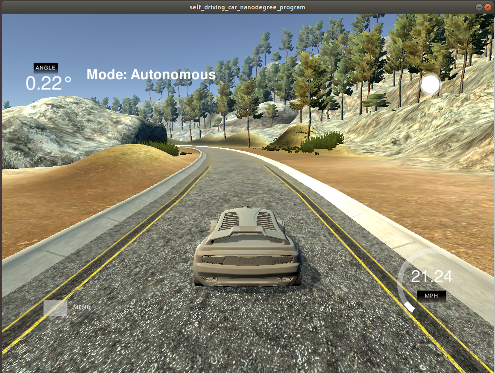
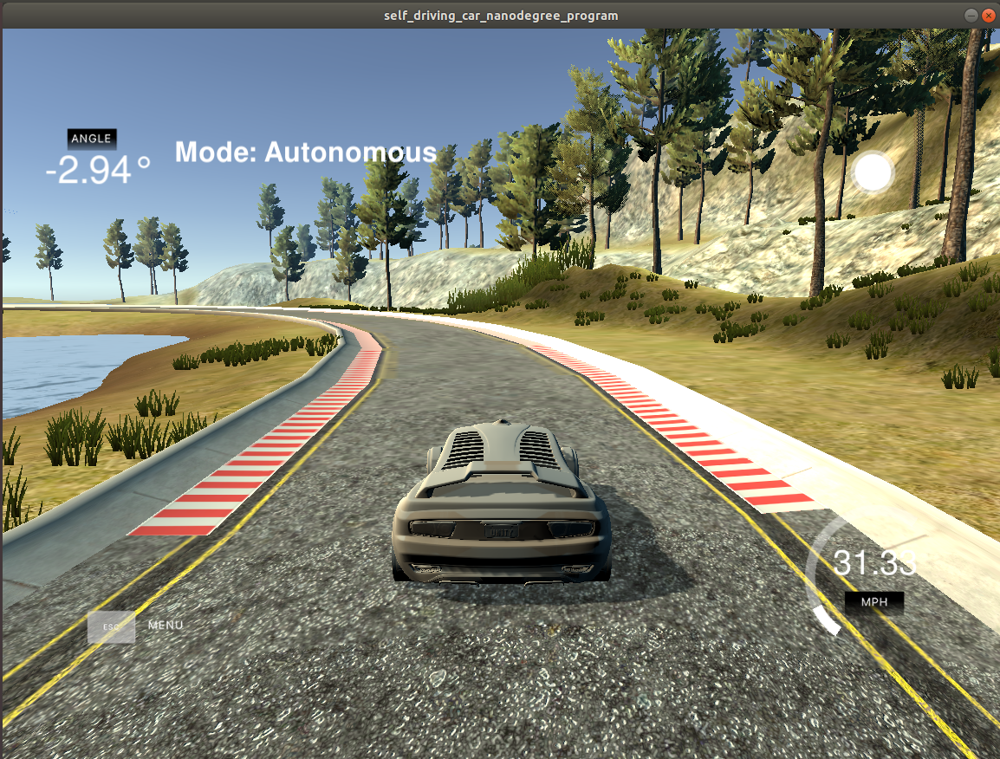
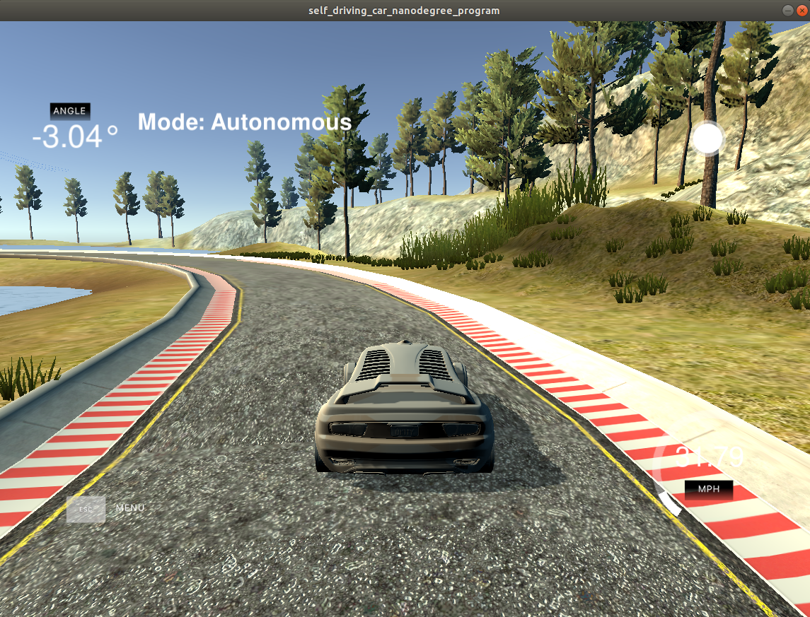
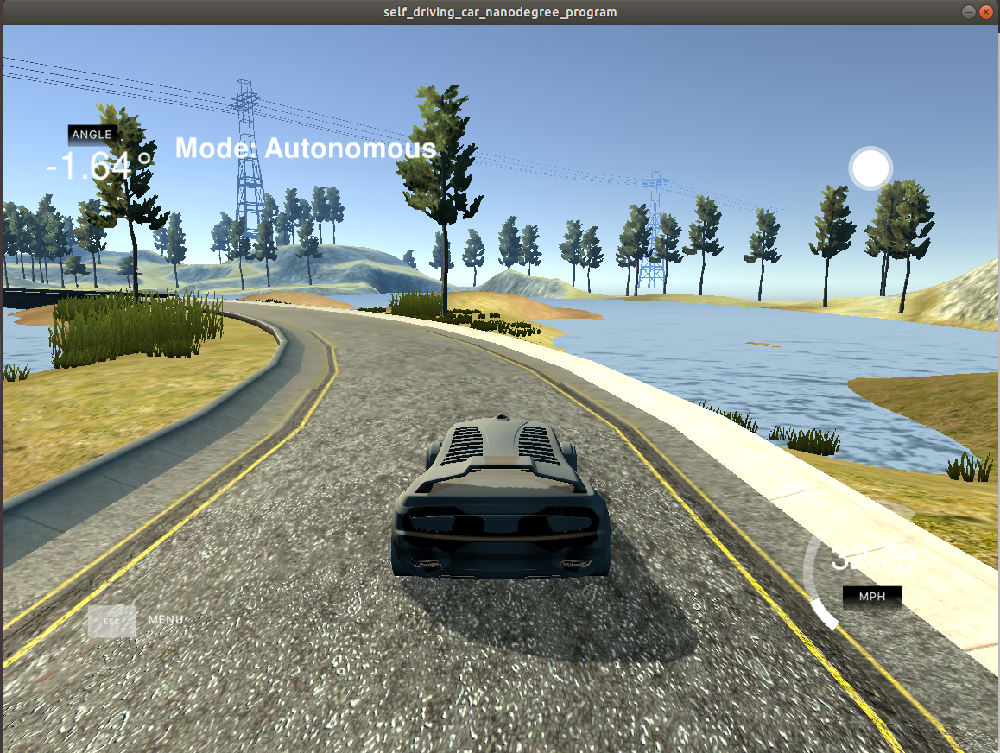
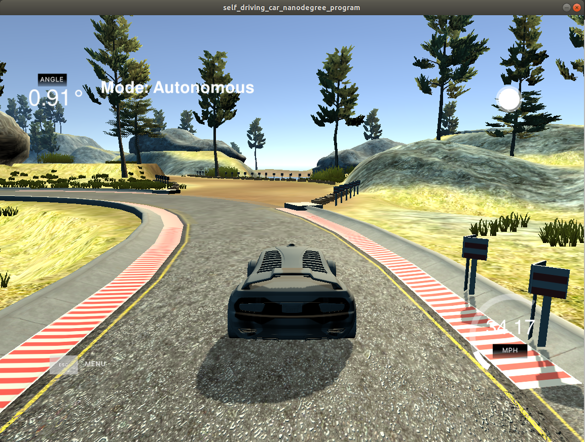
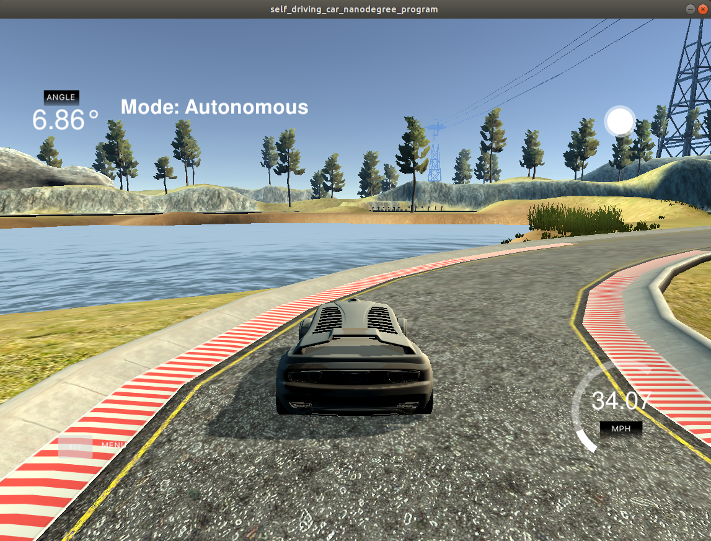
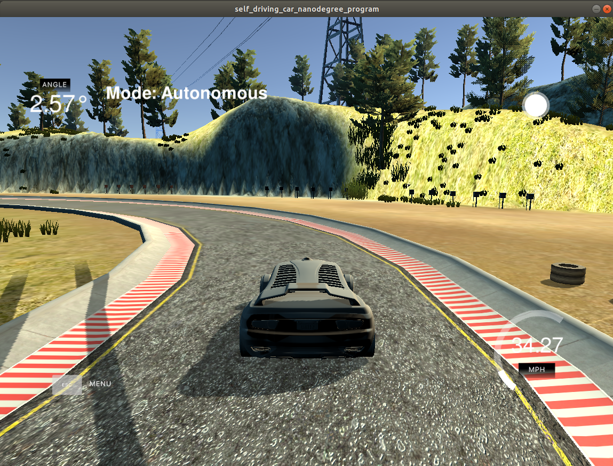
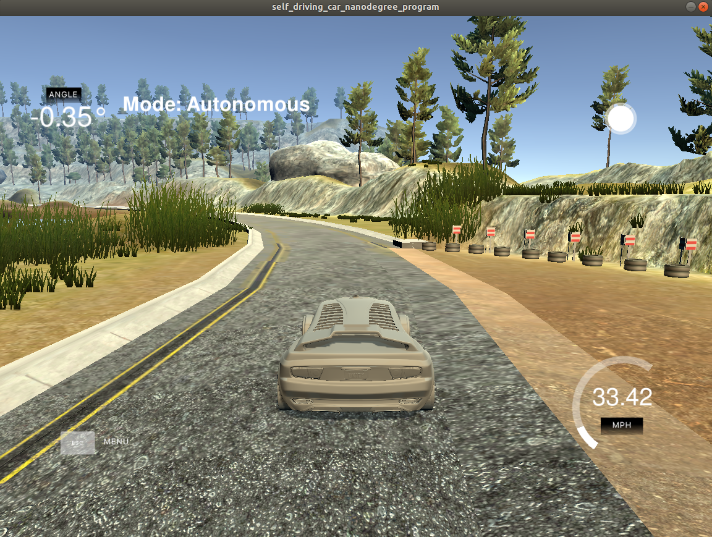

# CarND-Controls-PID
Self-Driving Car Engineer Nanodegree Program

---

## Dependencies

* cmake >= 3.5
 * All OSes: [click here for installation instructions](https://cmake.org/install/)
* make >= 4.1(mac, linux), 3.81(Windows)
  * Linux: make is installed by default on most Linux distros
  * Mac: [install Xcode command line tools to get make](https://developer.apple.com/xcode/features/)
  * Windows: [Click here for installation instructions](http://gnuwin32.sourceforge.net/packages/make.htm)
* gcc/g++ >= 5.4
  * Linux: gcc / g++ is installed by default on most Linux distros
  * Mac: same deal as make - [install Xcode command line tools]((https://developer.apple.com/xcode/features/)
  * Windows: recommend using [MinGW](http://www.mingw.org/)
* [uWebSockets](https://github.com/uWebSockets/uWebSockets)
  * Run either `./install-mac.sh` or `./install-ubuntu.sh`.
* Simulator. You can download these from the [project intro page](https://github.com/udacity/self-driving-car-sim/releases) in the classroom.

## Basic Build Instructions

1. Clone this repo.
2. Make a build directory: `mkdir build && cd build`
3. Compile: `cmake .. && make`
4. Run it: `./pid`. 

Tips for setting up the environment can be found [here](https://classroom.udacity.com/nanodegrees/nd013/parts/40f38239-66b6-46ec-ae68-03afd8a601c8/modules/0949fca6-b379-42af-a919-ee50aa304e6a/lessons/f758c44c-5e40-4e01-93b5-1a82aa4e044f/concepts/23d376c7-0195-4276-bdf0-e02f1f3c665d)

## PID controller
In the project context, the PID controller allows to drive an autonomous car around a defined trajectory. In order to do that, the car has to steer its angle to drive on the trajectory; the car uses the CTE (Cross Track Error) to calculate the steering value on proportion to the CTE value. The CTE represents the lateral distance between the car and the trajectory.

* P control: it's called the proportional controller. The idea of the P control is to use a constans Kp and multiply it to the CTE value, that implies the car will move near to the trajectory after time passed and it reduces the CTE value. Increasing the proportional gain (Kp) has the effect of proportionally increasing the control signal for the same level of error. The fact that the controller will push harder for a given level of error tends to overshoot more and the car to move out of the trajectory in oscillations.
* PD control: it's called the proportional-derivative controller. Besides of the P control, the D control uses the derivative of the CTE over time to reduce the oscillations of the car. The D part of the controller is multiplied by a constant Kd. The addition of a derivative term to the controller Kd adds the ability of the controller to "anticipate" error and to reduce overshooting.
* PID control: it adds the integral control. The addition of an integral term to the controller (Ki) tends to help reduce steady-state error and tries to eliminate a possible bias on the controller that could prevent the CTE to be minimized.

## Ki Kp Kd
I tuned the PID controller coefficients manually:
* If the proportional coeff is around 1.0 or larger, the car can go easier out of the track and start overshooting, so 0.15 is a good value for that.
* If the integral coefficient is greater than cero (either a big or small value) the car will drive in circles and it goes out the track very fast; so it should be zero.
* When the derivative coeff is around 3 or 4; it produces large steering angles and the driving turn really rough. By reducing it, the car drives in a smoother and more human mode so I decided to use 0.9.

## Final track
The car is able to drive sucessfully around the track without getting out of it:

  
  
  

